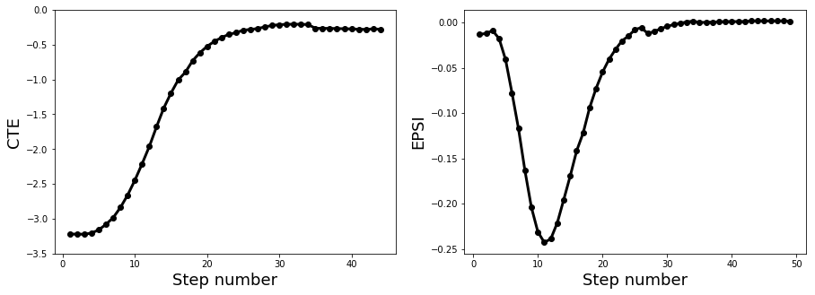
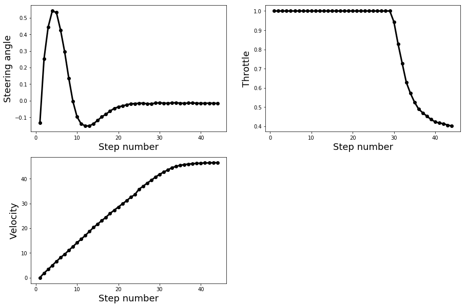

## Model Predictive Control (MPC) for self driving cars
---

In this project, a model prdictive control is developed for driving a self driving car in a sumation track.

## Model
The model state variables consist of the position (x,y), heading direction (psi), velocity (v), cross track error (cte) and heading direction error (epsi). The car is actuated using steering angle (delta) and throttle (a). The model of the car movement gives:

```
x_[t+1] = x[t] + v[t] * cos(psi[t]) * dt
y_[t+1] = y[t] + v[t] * sin(psi[t]) * dt
psi_[t+1] = psi[t] + v[t] / Lf * delta[t] * dt
v_[t+1] = v[t] + a[t-1] * dt
cte[t+1] = f(x[t]) - y[t] + v[t] * sin(epsi[t]) * dt
epsi[t+1] = psi[t] - psides[t] + v[t] * delta[t-1] / Lf * dt
```

## Cost
The costs are added for the following over time:
- Summing the `cte` 
- Summing the `epsi`
- Summing the pow2 of the `v` and `reference vel`
- Summing `delta`
- Summing `a`
- Summing the pow2 of `delta`+`v` for steering with high velocity 
- Summing `delta(t+1)-delta(t)` for smooth steering
- Summing `a(t+1)-a(t)` for smooth change in acceleration

Each one of the cost compnent have weights that determines its importance in planning. I experimented with the weights to find the best set of weights for the performance. 

For planning, the code minimizes the cost function over with the defined constraints. 

# Timestep Length and Frequency
The MPC algorithm takes the time length (`N`) and frequency (`dt`). Setting these parameters is critical to the performance that makes the drive unstable or with high error. I chose `N=7` and `dt=0.15` for the best performance through experiments. Decreasing or increasing `N`, with constant frequency, resulted in destabilizing the drive becasue of too short or too long planning time. Also increasing `N` for too long could increase the computation cost. Also, increasing the frequency results in planning with coarse planning that results in instability in turns, while decreasing the frequency with constant timestep length again reduces the planning time. 

# Polynomial Fitting and MPC Preprocessing
In the main function, waypoints (motion map, ptsx) is transfered into the car coordinates (px,py,psi) with:
```
xshift = ptsx - px;
yshift = ptsy - py;
x_shifted(i) = xshift*cos(-psi) - yshift*sin(-psi);
y_shifted(i) = xshift*sin(-psi) + yshift*cos(-psi);
```
Then, a 3rd order polynomial is fit to the points and fed to the MPC algorithm for calculations of `cte` and `psi` values over the planning time. After MPC processing, it returns the steering angle that and throttle that is gave to the simulator with proper conversion. The MPC algorithm also returns the planned points with (`N` and `dt`) for the following time.

# Model Predictive Control with Latency
In order to compensate for the latency, the state variables are projected to the time after latency (current time), based on the kenematics of the motion as: 
```
x = v*dt;
y = 0;
psi = v * (-delta) / Lf * dt;
v = v + a * dt;
cte = cte + v * sin(psi) * dt;
epsi = epsi - delta / Lf * dt;
```

# Results
In order to verify the performance of the MPC model, in the simulator, I strted the car on the side of the track and recorded the cross track error (`cte`), error in heading direction (`psi`) as the MPC tries to drive the car to the center of the track.



Initially the car starts with high `cte` but the `psi` is almost correct. The MPC somoothly reduces the `cte` while the `psi` increases (as expected) and returns back to the correct direction.

Also, the actuation values are recorded as shown below. The steering angle is constrained between [-1,1] with high cost for changing direction, therefore the angle smoothly changes and returns back to zero. As the car is initally has zero speed, the throttle is pushed all the way to reach the desired speed and gradually released when close the desired speed (50 mph). The velocity is alos shown that is gradually increased to reach the desired value. 



# Driving over the track
The vehicle successfully drives a lap around the track. No tire leaves the drivable portion of the track surface. The car does not pop up onto ledges or roll over any surfaces. 


## Dependencies

* cmake >= 3.5
 * All OSes: [click here for installation instructions](https://cmake.org/install/)
* make >= 4.1(mac, linux), 3.81(Windows)
  * Linux: make is installed by default on most Linux distros
  * Mac: [install Xcode command line tools to get make](https://developer.apple.com/xcode/features/)
  * Windows: [Click here for installation instructions](http://gnuwin32.sourceforge.net/packages/make.htm)
* gcc/g++ >= 5.4
  * Linux: gcc / g++ is installed by default on most Linux distros
  * Mac: same deal as make - [install Xcode command line tools]((https://developer.apple.com/xcode/features/)
  * Windows: recommend using [MinGW](http://www.mingw.org/)
* [uWebSockets](https://github.com/uWebSockets/uWebSockets)
  * Run either `install-mac.sh` or `install-ubuntu.sh`.
  * If you install from source, checkout to commit `e94b6e1`, i.e.
    ```
    git clone https://github.com/uWebSockets/uWebSockets
    cd uWebSockets
    git checkout e94b6e1
    ```
    Some function signatures have changed in v0.14.x. See [this PR](https://github.com/udacity/CarND-MPC-Project/pull/3) for more details.


## Basic Build Instructions

1. Clone this repo.
2. Make a build directory: `mkdir build && cd build`
3. Compile: `cmake .. && make`
4. Run it: `./mpc`.

